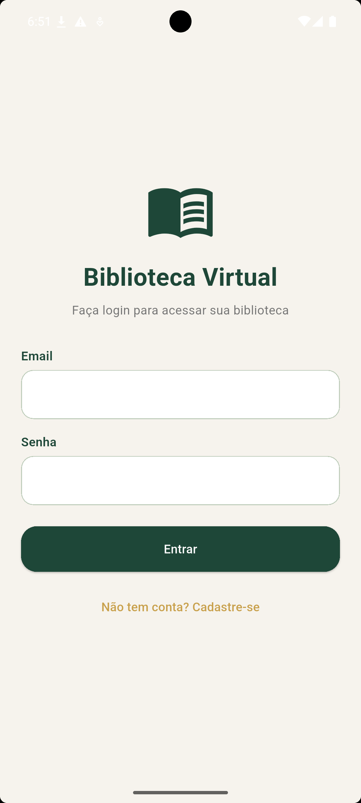
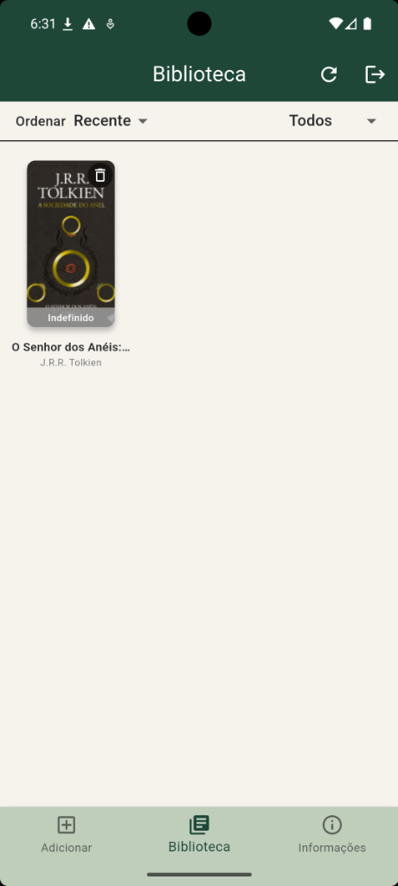
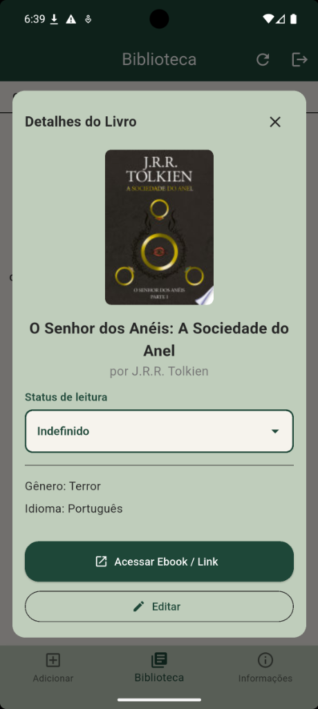
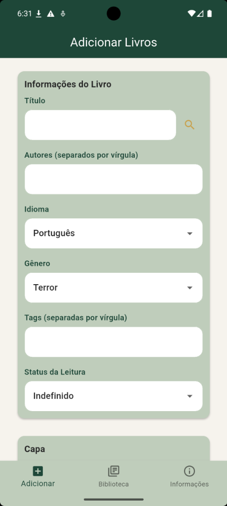
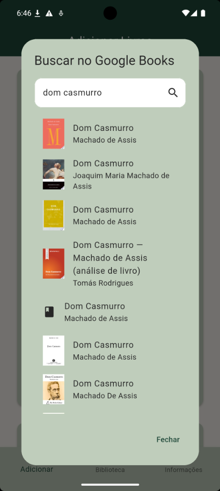

# Biblioteca Virtual

Uma biblioteca virtual e gerenciador de leitura pessoal moderno desenvolvido em Flutter com integração em tempo real ao Supabase.

---

### Versão Atual: `v1.1.0`

---

## Screenshots da Aplicação

| Tela de Login | Biblioteca / Lista de Livros | Detalhes do Livro |
| :---: | :---: | :---: |
|  |  |  |

| Adicionar Novo Livro | Autocomplete Google Books |
| :---: | :---: |
|  |  |

---

## Funcionalidades

- **Controle de Contas (Supabase Auth)**: Registro e login seguro com isolamento de biblioteca por perfil através de Row Level Security (RLS).
- **Busca Automatizada (Google Books API)**: Autocompleta Título, Autor, Gêneros, Idioma e Capa digitando apenas o título ou autor do livro.
- **Gerenciamento Inteligente de Tags**: Sugestões de tags autocompletáveis com base nas tags já cadastradas em outros livros para evitar duplicidades.
- **Status de Leitura Customizável**: Controle de leitura com os status: *Lendo*, *Na Fila*, *Lido*, *Larguei* e *Indefinido*.
- **Filtros e Ordenação**: Filtre seus livros por status e ordene por títulos, data de adição ou ordem do status de leitura.
